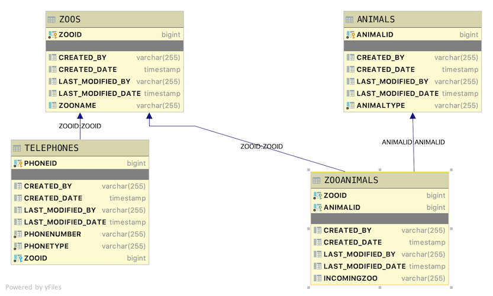

# Java Zoos

A student that completes this project shows that they can:

* Add additional fields to a Many to Many Join Table
* Add standard auditing fields to each table
* Populate and display standard auditing fields
* Use SQL, JPA and Hibernate to perform custom query operations on a RDBMS through a Spring Application
* Use SQL, JPA and Hibernate to perform custom data manipulation operations on a RDBMS through a Spring Application
* Implement default Swagger documentation

## Introduction

This is a basic database scheme with zoos, animals, and telephones for the zoos. This Java Spring REST API application will provide endpoints for clients to read various data sets contained in the application's data.

### Database layout

You are creating a Java Spring REST API server that stores data in an H2 database. The table layouts should be



* All tables contain the following auditing fields
  * `created_by` - user name who created the row. Should default to **SYSTEM**
  * `created_date` - date field when the row was created
  * `last_modified_by` - user name who last changed data in the row. Should default to **SYSTEM**
  * `last_modified_date` - date field when the data in the row was last changed

* Zoo
  * `zooid` - long primary key
  * `zooname` - String Name of the Zoo

* Telephone
  * `phoneid` - long primary key
  * `phonetype` - String - something like MAIN, EDUCATION, MEMBERSHIP, FAX, OPERATOR, OTHER
  * `phonenumber` - String - a telephone number in any format
  * `zooid` - foreign key to the Zoo table indicating the zoo who holds this telephone number
  
There is a one to many relationship between zoos and telephones. One zoo can have multiple phone numbers but each phone number can only belong to one zoo.

* Animal
  * `animalid` - long primary key
  * `animaltype` - String - the type of animal such as lion or llama
  * `incomingzoo` - String - the name of the zoo when the animal came from. The field can be left blank or null if the animal does not come from another zoo.

There is a many to many relationship between zoos and animals. A zoo may have many animal types and an animal type may be at many zoos.

Using the provided seed data, a successful application will return the follow data based on the given endpoint. Expand the section of the endpoint to see the data that is returned.

### MVP

<details>
<summary>http://localhost:2019/animals/count</summary>

```JSON
[
    {
        "animaltype": "bear",
        "animalid": 2,
        "countzoos": 3
    },
    {
        "animaltype": "lion",
        "animalid": 1,
        "countzoos": 3
    },
    {
        "animaltype": "llama",
        "animalid": 6,
        "countzoos": 1
    },
    {
        "animaltype": "monkey",
        "animalid": 3,
        "countzoos": 0
    },
    {
        "animaltype": "penguin",
        "animalid": 4,
        "countzoos": 0
    },
    {
        "animaltype": "tiger",
        "animalid": 5,
        "countzoos": 1
    },
    {
        "animaltype": "turtle",
        "animalid": 7,
        "countzoos": 1
    }
]
```

</details>

<details>
<summary>http://localhost:2019/zoos/zoos</summary>

```JSON
[
    {
        "zooid": 1,
        "zooname": "Gladys Porter Zoo",
        "telephones": [
            {
                "phoneid": 1,
                "phonetype": "MAIN",
                "phonenumber": "555-555-5555"
            },
            {
                "phoneid": 2,
                "phonetype": "EDUCATION",
                "phonenumber": "555-555-1234"
            },
            {
                "phoneid": 3,
                "phonetype": "MEMBERSHIP",
                "phonenumber": "555-555-4321"
            }
        ],
        "animals": [
            {
                "animal": {
                    "animalid": 1,
                    "animaltype": "lion"
                },
                "incomingzoo": "Point Defiance Zoo"
            },
            {
                "animal": {
                    "animalid": 2,
                    "animaltype": "bear"
                },
                "incomingzoo": "Point Defiance Zoo"
            }
        ]
    },
    {
        "zooid": 2,
        "zooname": "Point Defiance Zoo",
        "telephones": [],
        "animals": [
            {
                "animal": {
                    "animalid": 2,
                    "animaltype": "bear"
                },
                "incomingzoo": "Gladys Porter Zoo"
            }
        ]
    },
    {
        "zooid": 3,
        "zooname": "San Diego Zoo",
        "telephones": [
            {
                "phoneid": 5,
                "phonetype": "MAIN",
                "phonenumber": "555-123-5555"
            }
        ],
        "animals": [
            {
                "animal": {
                    "animalid": 1,
                    "animaltype": "lion"
                },
                "incomingzoo": "Gladys Porter Zoo"
            },
            {
                "animal": {
                    "animalid": 2,
                    "animaltype": "bear"
                },
                "incomingzoo": "Point Defiance Zoo"
            }
        ]
    },
    {
        "zooid": 4,
        "zooname": "San Antonio Zoo",
        "telephones": [
            {
                "phoneid": 4,
                "phonetype": "MAIN",
                "phonenumber": "123-555-5555"
            }
        ],
        "animals": []
    },
    {
        "zooid": 5,
        "zooname": "Smithsonian National Zoo",
        "telephones": [],
        "animals": [
            {
                "animal": {
                    "animalid": 7,
                    "animaltype": "turtle"
                },
                "incomingzoo": "San Diego Zoo"
            },
            {
                "animal": {
                    "animalid": 6,
                    "animaltype": "llama"
                },
                "incomingzoo": "Gladys Porter Zoo"
            },
            {
                "animal": {
                    "animalid": 5,
                    "animaltype": "tiger"
                },
                "incomingzoo": "Gladys Porter Zoo"
            },
            {
                "animal": {
                    "animalid": 1,
                    "animaltype": "lion"
                },
                "incomingzoo": "Gladys Porter Zoo"
            }
        ]
    }
]
```

</details>

<details>
<summary>http://localhost:2019/zoos/zoo/5</summary>

```JSON
{
    "zooid": 5,
    "zooname": "Smithsonian National Zoo",
    "telephones": [],
    "animals": [
        {
            "animal": {
                "animalid": 7,
                "animaltype": "turtle"
            },
            "incomingzoo": "San Diego Zoo"
        },
        {
            "animal": {
                "animalid": 6,
                "animaltype": "llama"
            },
            "incomingzoo": "Gladys Porter Zoo"
        },
        {
            "animal": {
                "animalid": 5,
                "animaltype": "tiger"
            },
            "incomingzoo": "Gladys Porter Zoo"
        },
        {
            "animal": {
                "animalid": 1,
                "animaltype": "lion"
            },
            "incomingzoo": "Gladys Porter Zoo"
        }
    ]
}
```

</details>

<details>
<summary>POST http://localhost:2019/zoos/zoo</summary>

DATA

```JSON
{
    "zooname": "Lambda Llama School Zoo",
    "telephones": [
            {
                "phonetype": "OTHER",
                "phonenumber": "555-555-5555"
            },
            {
                "phonetype": "EDUCATION",
                "phonenumber": "555-555-1234"
            }
        ],
    "animals": [
        {
            "animal": {
                "animalid": 1
            },
            "incomingzoo": "San Diego Zoo"
        },
        {
            "animal": {
                "animalid": 2
            },
            "incomingzoo": "Gladys Porter Zoo"
        },
        {
            "animal": {
                "animalid": 3,
                "animaltype": "tiger"
            }
        }
    ]
}
```

OUTPUT

```TEXT
No Body Data

Location Header: http://localhost:2019/zoos/zoo/10
Status 201 Created
```

</details>

<details>
<summary>PUT http://localhost:2019/zoos/zoo/5</summary>

DATA

```JSON
{
    "zooname": "The Best Zoo",
    "telephones": [
            {
                "phonetype": "OTHER",
                "phonenumber": "555-555-5555"
            }
        ],
    "animals": [
        {
            "animal": {
                "animalid": 3
            },
            "incomingzoo": "San Diego Zoo"
        },
        {
            "animal": {
                "animalid": 5
            },
            "incomingzoo": "Gladys Porter Zoo"
        },
        {
            "animal": {
                "animalid": 7,
                "animaltype": "tiger"
            }
        }
    ]
}
```

OUTPUT

```TEXT
No Body Text

Status OK
```

</details>

<details>
<summary>PATCH http://localhost:2019/zoos/zoo/4</summary>

DATA

```JSON
{
     "telephones": [
            {
                "phonetype": "OTHER",
                "phonenumber": "555-555-5555"
            }
        ]
}
```

OUTPUT

```TEXT
No Body Data

Status OK
```

</details>

<details>
<summary>DELETE http://localhost:2019/zoos/zoo/5</summary>

OUTPUT

```TEXT
No Body Data

Status OK
```

</details>

### Stretch Goals

***Major changes in database layout so all the endpoints are redone below***

<details>
<summary>http://localhost:2019/animals/count</summary>

```JSON
[
    {
        "animaltype": "bear",
        "animalid": 2,
        "countzoos": 3
    },
    {
        "animaltype": "lion",
        "animalid": 1,
        "countzoos": 3
    },
    {
        "animaltype": "llama",
        "animalid": 6,
        "countzoos": 1
    },
    {
        "animaltype": "monkey",
        "animalid": 3,
        "countzoos": 0
    },
    {
        "animaltype": "penguin",
        "animalid": 4,
        "countzoos": 0
    },
    {
        "animaltype": "tiger",
        "animalid": 5,
        "countzoos": 1
    },
    {
        "animaltype": "turtle",
        "animalid": 7,
        "countzoos": 1
    }
]
```

</details>

<details>
<summary>http://localhost:2019/zoos/zoos</summary>

```JSON
[
    {
        "zooid": 1,
        "zooname": "Gladys Porter Zoo",
        "telephones": [
            {
                "phoneid": 1,
                "phonetype": "MAIN",
                "phonenumber": "555-555-5555"
            },
            {
                "phoneid": 2,
                "phonetype": "EDUCATION",
                "phonenumber": "555-555-1234"
            },
            {
                "phoneid": 3,
                "phonetype": "MEMBERSHIP",
                "phonenumber": "555-555-4321"
            }
        ],
        "animals": [
            {
                "animal": {
                    "animalid": 1,
                    "animaltype": "lion"
                },
                "incomingzoo": {
                    "zooid": 2,
                    "zooname": "Point Defiance Zoo",
                    "telephones": []
                }
            },
            {
                "animal": {
                    "animalid": 2,
                    "animaltype": "bear"
                },
                "incomingzoo": {
                    "zooid": 2,
                    "zooname": "Point Defiance Zoo",
                    "telephones": []
                }
            }
        ]
    },
    {
        "zooid": 2,
        "zooname": "Point Defiance Zoo",
        "telephones": [],
        "animals": [
            {
                "animal": {
                    "animalid": 2,
                    "animaltype": "bear"
                },
                "incomingzoo": {
                    "zooid": 1,
                    "zooname": "Gladys Porter Zoo",
                    "telephones": [
                        {
                            "phoneid": 1,
                            "phonetype": "MAIN",
                            "phonenumber": "555-555-5555"
                        },
                        {
                            "phoneid": 2,
                            "phonetype": "EDUCATION",
                            "phonenumber": "555-555-1234"
                        },
                        {
                            "phoneid": 3,
                            "phonetype": "MEMBERSHIP",
                            "phonenumber": "555-555-4321"
                        }
                    ]
                }
            }
        ]
    },
    {
        "zooid": 3,
        "zooname": "San Diego Zoo",
        "telephones": [
            {
                "phoneid": 5,
                "phonetype": "MAIN",
                "phonenumber": "555-123-5555"
            }
        ],
        "animals": [
            {
                "animal": {
                    "animalid": 1,
                    "animaltype": "lion"
                },
                "incomingzoo": {
                    "zooid": 1,
                    "zooname": "Gladys Porter Zoo",
                    "telephones": [
                        {
                            "phoneid": 1,
                            "phonetype": "MAIN",
                            "phonenumber": "555-555-5555"
                        },
                        {
                            "phoneid": 2,
                            "phonetype": "EDUCATION",
                            "phonenumber": "555-555-1234"
                        },
                        {
                            "phoneid": 3,
                            "phonetype": "MEMBERSHIP",
                            "phonenumber": "555-555-4321"
                        }
                    ]
                }
            },
            {
                "animal": {
                    "animalid": 2,
                    "animaltype": "bear"
                },
                "incomingzoo": {
                    "zooid": 2,
                    "zooname": "Point Defiance Zoo",
                    "telephones": []
                }
            }
        ]
    },
    {
        "zooid": 4,
        "zooname": "San Antonio Zoo",
        "telephones": [
            {
                "phoneid": 4,
                "phonetype": "MAIN",
                "phonenumber": "123-555-5555"
            }
        ],
        "animals": []
    },
    {
        "zooid": 5,
        "zooname": "Smithsonian National Zoo",
        "telephones": [],
        "animals": [
            {
                "animal": {
                    "animalid": 7,
                    "animaltype": "turtle"
                },
                "incomingzoo": {
                    "zooid": 3,
                    "zooname": "San Diego Zoo",
                    "telephones": [
                        {
                            "phoneid": 5,
                            "phonetype": "MAIN",
                            "phonenumber": "555-123-5555"
                        }
                    ]
                }
            },
            {
                "animal": {
                    "animalid": 6,
                    "animaltype": "llama"
                },
                "incomingzoo": {
                    "zooid": 1,
                    "zooname": "Gladys Porter Zoo",
                    "telephones": [
                        {
                            "phoneid": 1,
                            "phonetype": "MAIN",
                            "phonenumber": "555-555-5555"
                        },
                        {
                            "phoneid": 2,
                            "phonetype": "EDUCATION",
                            "phonenumber": "555-555-1234"
                        },
                        {
                            "phoneid": 3,
                            "phonetype": "MEMBERSHIP",
                            "phonenumber": "555-555-4321"
                        }
                    ]
                }
            },
            {
                "animal": {
                    "animalid": 5,
                    "animaltype": "tiger"
                },
                "incomingzoo": {
                    "zooid": 1,
                    "zooname": "Gladys Porter Zoo",
                    "telephones": [
                        {
                            "phoneid": 1,
                            "phonetype": "MAIN",
                            "phonenumber": "555-555-5555"
                        },
                        {
                            "phoneid": 2,
                            "phonetype": "EDUCATION",
                            "phonenumber": "555-555-1234"
                        },
                        {
                            "phoneid": 3,
                            "phonetype": "MEMBERSHIP",
                            "phonenumber": "555-555-4321"
                        }
                    ]
                }
            },
            {
                "animal": {
                    "animalid": 1,
                    "animaltype": "lion"
                },
                "incomingzoo": {
                    "zooid": 1,
                    "zooname": "Gladys Porter Zoo",
                    "telephones": [
                        {
                            "phoneid": 1,
                            "phonetype": "MAIN",
                            "phonenumber": "555-555-5555"
                        },
                        {
                            "phoneid": 2,
                            "phonetype": "EDUCATION",
                            "phonenumber": "555-555-1234"
                        },
                        {
                            "phoneid": 3,
                            "phonetype": "MEMBERSHIP",
                            "phonenumber": "555-555-4321"
                        }
                    ]
                }
            }
        ]
    }
]
```

</details>

<details>
<summary>http://localhost:2019/zoos/zoo/5</summary>

```JSON
{
    "zooid": 3,
    "zooname": "San Diego Zoo",
    "telephones": [
        {
            "phoneid": 5,
            "phonetype": "MAIN",
            "phonenumber": "555-123-5555"
        }
    ],
    "animals": [
        {
            "animal": {
                "animalid": 1,
                "animaltype": "lion"
            },
            "incomingzoo": {
                "zooid": 1,
                "zooname": "Gladys Porter Zoo",
                "telephones": [
                    {
                        "phoneid": 1,
                        "phonetype": "MAIN",
                        "phonenumber": "555-555-5555"
                    },
                    {
                        "phoneid": 2,
                        "phonetype": "EDUCATION",
                        "phonenumber": "555-555-1234"
                    },
                    {
                        "phoneid": 3,
                        "phonetype": "MEMBERSHIP",
                        "phonenumber": "555-555-4321"
                    }
                ]
            }
        },
        {
            "animal": {
                "animalid": 2,
                "animaltype": "bear"
            },
            "incomingzoo": {
                "zooid": 2,
                "zooname": "Point Defiance Zoo",
                "telephones": []
            }
        }
    ]
}
```

</details>

<details>
<summary>POST http://localhost:2019/zoos/zoo</summary>

DATA

```JSON
{
    "zooname": "Lambda Llama School Zoo",
    "telephones": [
            {
                "phonetype": "OTHER",
                "phonenumber": "555-555-5555"
            },
            {
                "phonetype": "EDUCATION",
                "phonenumber": "555-555-1234"
            }
        ],
    "animals": [
        {
            "animal": {
                "animalid": 1
            },
            "incomingzoo": {
                "zooid" : 1
            }
        },
        {
            "animal": {
                "animalid": 2
            },
            "incomingzoo": {
                "zooid" : 5
            }
        },
        {
            "animal": {
                "animalid": 3,
                "animaltype": "tiger"
            }
        }
    ]
}
```

OUTPUT

```TEXT
No Body Data

Location Header: http://localhost:2019/zoos/zoo/10
Status 201 Created
```

</details>

<details>
<summary>PUT http://localhost:2019/zoos/zoo/5</summary>

DATA

```JSON
{
    "zooname": "The Best Zoo",
    "telephones": [
            {
                "phonetype": "OTHER",
                "phonenumber": "555-555-5555"
            }
        ],
    "animals": [
        {
            "animal": {
                "animalid": 3
            },
            "incomingzoo":  {
                "zooid" : 3
            }
        },
        {
            "animal": {
                "animalid": 5
            },
            "incomingzoo":  {
                "zooid" : 1
            }
        },
        {
            "animal": {
                "animalid": 7,
                "animaltype": "tiger"
            }
        }
    ]
}
```

OUTPUT

```TEXT
No Body Text

Status OK
```

</details>

<details>
<summary>PATCH http://localhost:2019/zoos/zoo/4</summary>

DATA

```JSON
{
    "telephones": [
            {
                "phonetype": "OTHER",
                "phonenumber": "555-555-5555"
            }
        ]
}
```

OUTPUT

```TEXT
No Body Data

Status OK
```

</details>

<details>
<summary>DELETE http://localhost:2019/zoos/zoo/4</summary>

OUTPUT

```TEXT
No Body Data

Status OK
```

</details>

<details>
<summary>http://localhost:2019/zoos/zoo/namelike/zoo</summary>

```JSON
[
    {
        "zooid": 1,
        "zooname": "Gladys Porter Zoo",
        "telephones": [
            {
                "phoneid": 1,
                "phonetype": "MAIN",
                "phonenumber": "555-555-5555"
            },
            {
                "phoneid": 2,
                "phonetype": "EDUCATION",
                "phonenumber": "555-555-1234"
            },
            {
                "phoneid": 3,
                "phonetype": "MEMBERSHIP",
                "phonenumber": "555-555-4321"
            }
        ],
        "animals": [
            {
                "animal": {
                    "animalid": 1,
                    "animaltype": "lion"
                },
                "incomingzoo": {
                    "zooid": 2,
                    "zooname": "Point Defiance Zoo",
                    "telephones": []
                }
            },
            {
                "animal": {
                    "animalid": 2,
                    "animaltype": "bear"
                },
                "incomingzoo": {
                    "zooid": 2,
                    "zooname": "Point Defiance Zoo",
                    "telephones": []
                }
            }
        ]
    },
    {
        "zooid": 2,
        "zooname": "Point Defiance Zoo",
        "telephones": [],
        "animals": [
            {
                "animal": {
                    "animalid": 2,
                    "animaltype": "bear"
                },
                "incomingzoo": {
                    "zooid": 1,
                    "zooname": "Gladys Porter Zoo",
                    "telephones": [
                        {
                            "phoneid": 1,
                            "phonetype": "MAIN",
                            "phonenumber": "555-555-5555"
                        },
                        {
                            "phoneid": 2,
                            "phonetype": "EDUCATION",
                            "phonenumber": "555-555-1234"
                        },
                        {
                            "phoneid": 3,
                            "phonetype": "MEMBERSHIP",
                            "phonenumber": "555-555-4321"
                        }
                    ]
                }
            }
        ]
    },
    {
        "zooid": 3,
        "zooname": "San Diego Zoo",
        "telephones": [
            {
                "phoneid": 5,
                "phonetype": "MAIN",
                "phonenumber": "555-123-5555"
            }
        ],
        "animals": [
            {
                "animal": {
                    "animalid": 1,
                    "animaltype": "lion"
                },
                "incomingzoo": {
                    "zooid": 1,
                    "zooname": "Gladys Porter Zoo",
                    "telephones": [
                        {
                            "phoneid": 1,
                            "phonetype": "MAIN",
                            "phonenumber": "555-555-5555"
                        },
                        {
                            "phoneid": 2,
                            "phonetype": "EDUCATION",
                            "phonenumber": "555-555-1234"
                        },
                        {
                            "phoneid": 3,
                            "phonetype": "MEMBERSHIP",
                            "phonenumber": "555-555-4321"
                        }
                    ]
                }
            },
            {
                "animal": {
                    "animalid": 2,
                    "animaltype": "bear"
                },
                "incomingzoo": {
                    "zooid": 2,
                    "zooname": "Point Defiance Zoo",
                    "telephones": []
                }
            }
        ]
    },
    {
        "zooid": 5,
        "zooname": "The Best Zoo",
        "telephones": [
            {
                "phoneid": 15,
                "phonetype": "OTHER",
                "phonenumber": "555-555-5555"
            }
        ],
        "animals": [
            {
                "animal": {
                    "animalid": 3,
                    "animaltype": "monkey"
                },
                "incomingzoo": {
                    "zooid": 3,
                    "zooname": "San Diego Zoo",
                    "telephones": [
                        {
                            "phoneid": 5,
                            "phonetype": "MAIN",
                            "phonenumber": "555-123-5555"
                        }
                    ]
                }
            },
            {
                "animal": {
                    "animalid": 5,
                    "animaltype": "tiger"
                },
                "incomingzoo": {
                    "zooid": 1,
                    "zooname": "Gladys Porter Zoo",
                    "telephones": [
                        {
                            "phoneid": 1,
                            "phonetype": "MAIN",
                            "phonenumber": "555-555-5555"
                        },
                        {
                            "phoneid": 2,
                            "phonetype": "EDUCATION",
                            "phonenumber": "555-555-1234"
                        },
                        {
                            "phoneid": 3,
                            "phonetype": "MEMBERSHIP",
                            "phonenumber": "555-555-4321"
                        }
                    ]
                }
            },
            {
                "animal": {
                    "animalid": 7,
                    "animaltype": "turtle"
                },
                "incomingzoo": null
            }
        ]
    },
    {
        "zooid": 10,
        "zooname": "Lambda Llama School Zoo",
        "telephones": [
            {
                "phoneid": 11,
                "phonetype": "OTHER",
                "phonenumber": "555-555-5555"
            },
            {
                "phoneid": 12,
                "phonetype": "EDUCATION",
                "phonenumber": "555-555-1234"
            }
        ],
        "animals": [
            {
                "animal": {
                    "animalid": 1,
                    "animaltype": "lion"
                },
                "incomingzoo": {
                    "zooid": 1,
                    "zooname": "Gladys Porter Zoo",
                    "telephones": [
                        {
                            "phoneid": 1,
                            "phonetype": "MAIN",
                            "phonenumber": "555-555-5555"
                        },
                        {
                            "phoneid": 2,
                            "phonetype": "EDUCATION",
                            "phonenumber": "555-555-1234"
                        },
                        {
                            "phoneid": 3,
                            "phonetype": "MEMBERSHIP",
                            "phonenumber": "555-555-4321"
                        }
                    ]
                }
            },
            {
                "animal": {
                    "animalid": 2,
                    "animaltype": "bear"
                },
                "incomingzoo": {
                    "zooid": 5,
                    "zooname": "The Best Zoo",
                    "telephones": [
                        {
                            "phoneid": 15,
                            "phonetype": "OTHER",
                            "phonenumber": "555-555-5555"
                        }
                    ]
                }
            },
            {
                "animal": {
                    "animalid": 3,
                    "animaltype": "monkey"
                },
                "incomingzoo": null
            }
        ]
    }
]
```

</details>

<details>
<summary>POST http://localhost:2019/zoos/zoo/3/animal/4/originated/0</summary>

OUTPUT

```TEXT
No Body Data

Status 201 Created
```

</details>

<details>
<summary>DELETE http://localhost:2019/zoos/zoo/1/animal/2</summary>

OUTPUT

```TEXT
No Body Data

Status OK
```

</details>

## Instructions

* [ ] Please fork and clone this repository. This repository does not have a starter project, so create one inside of the cloned repository folder. Regularly commit and push your code as appropriate.
* [ ] Create the entities needed to store this data.
* [ ] A data.sql file has been provided with seed data. You can use this class directly or modify it to fit your models. However, the data found in the file is the seed data to use!
* [ ] Add default Swagger Documentation

Expose the following Endpoint

* [ ] GET /animals/count -  that returns a JSON object list listing the animals and a count of how many zoos where they can be found. Use a custom query for this.
* [ ] GET /zoos/zoos - returns all zoos with their phone numbers and animals
* [ ] GET /zoos/zoo/{id} - returns all information related to a zoo based on its id
* [ ] POST /zoos/zoo - adds a zoo including new telephone number and zoo animal combinations. The Animal Type must already exist.  * In the header return as the location of the newly created zoo POST /zoos/zoo/{id}
* [ ] PUT /zoos/zoo/{id} - Completely replace the zoo record and all accompany records based off of the given zoo id.
* [ ] PATCH /zoos/zoo{id} - Updates the zoo with new information. Only the new data is to be sent from the frontend client.
* [ ] DELETE /zoos/zoo/{id} - delete the zoo, associated phone numbers, and zoo animals combination associated with this zoo id

## Stretch goals

* [ ] GET /zoos/zoo/namelike/{name} - returns a list of all the zoos with their information who have the given substring in their name
* [ ] DELETE /zoo/zoo/{zooid}/animal/{animalid} - delete the zoo animal combination based off of ids.
  * Hint: @PathVariable("zooid") long zooid, @PathVariable("animalid") long animalid
* [ ] POST /zoos/zoo/{zooid}/animal/{animalid} - adds the zoo animal combination based off of ids.
  * Hint: @PathVariable("zooid") long zooid, @PathVariable("animalid") long animalid
* [ ] Change the telephone type to an Enumerated Type.
  * Hint: For more information, see [https://www.geeksforgeeks.org/enum-in-java/](https://www.geeksforgeeks.org/enum-in-java/)
* [ ] Change the incoming zoo name to use an existing zoo record (zoo id) in a Many To One relationship
  * Hint: incomingzoo as a String field is replaced by incomingzooid which is a foreign key in the Zoo Animals table to the Zoos table
  * Hint: For more information, see [https://www.baeldung.com/jpa-join-column](https://www.baeldung.com/jpa-join-column)
